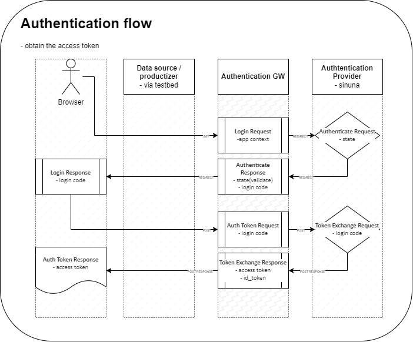

# Authentication GW

An authentication / authorization service for test & experimenting purposes of the Virtual Finland Development use-cases.

## Description

Authentication GW is a service that implements the OpenID Connect Authorization part between the browser client and the authentication provider service.

The authtentication request flows redirect the user to the authentication provider service, which in turn redirects the user back to the client with the authorization access token and the related info.

_Figure: The authenticate requests flow_

The authorization request flows use the access token for validating the user's identity and authorizing the user to access the requested resources.

_Figure: The authorize requests flow_

## Development

The development setup can be set up using vscode devcontainers or with local tools

### Run with vscode devcontainer

Read more of the vscode devcontainers here: https://code.visualstudio.com/docs/remote/containers

- Open the project folder as devcontainer
- Browse the API-docs at http://localhost:3000/
  - In the container, the default `postStartCommand` is set to `npm run start` which should publish the endpoint

### Run with local tools

- `npm install`
- `npm run start`

## Usage

- Swagger docs: http://localhost:3000/docs/

- Documentation for using the service in frontend apps: [./docs/frontend-app-usage.md](docs/frontend-app-usage.md)

## References

- https://developer.sinuna.fi/integration_documentation/
- https://swagger.io/docs/specification/about/
- https://github.com/anttiviljami/openapi-backend
- https://github.com/sylwit/aws-serverless-swagger-ui
