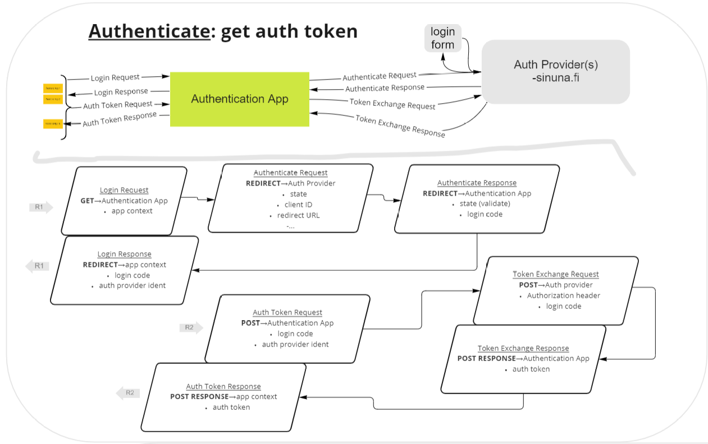

# Authentication GW

An autentication flow service

## Description

Authentication GW is a service that implements the OpenID Connect Authorization part between the browser client and the authentication provider service.

_Figure: The login requests flow_

## Development

The development setup can be set up using vscode devcontainers or with local tools

### Run with vscode devcontainer

Read more of the vscode devcontainers here: https://code.visualstudio.com/docs/remote/containers

- Open the project folder as devcontainer
- In the container, start development with a terminal command `npm run start`

### Run with local tools

- `npm install`
- `npm run start`

## Usage

- Swagger docs: http://localhost:3000/docs/

- Documentation for using the service in frontend apps: [./docs/frontend-app-usage.md](docs/frontend-app-usage.md)

## References

- https://developer.sinuna.fi/integration_documentation/
- https://swagger.io/docs/specification/about/
- https://github.com/anttiviljami/openapi-backend
- https://github.com/sylwit/aws-serverless-swagger-ui
