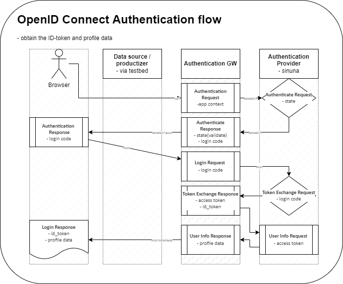
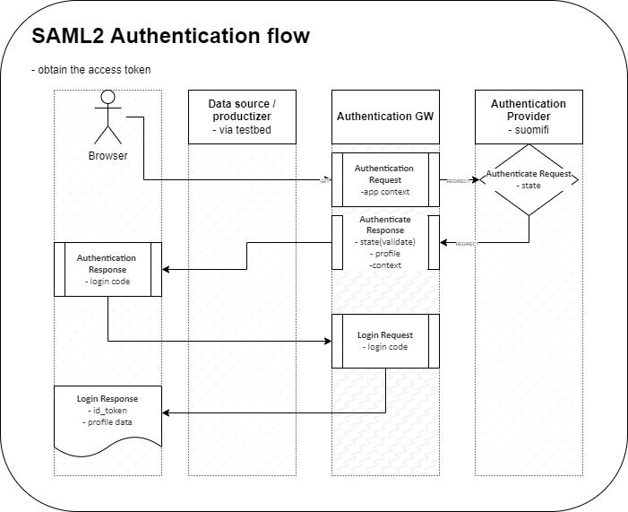
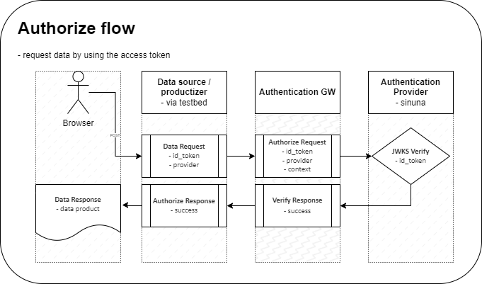

# Authentication GW

An authentication / authorization service for test & experimenting purposes of the Virtual Finland Development use-cases.

[](https://github.com/Virtual-Finland-Development/authentication-gw/actions/workflows/build-test-deploy.yml)

[](https://vscode.dev/redirect?url=vscode://ms-vscode-remote.remote-containers/cloneInVolume?url=https://github.com/Virtual-Finland-Development/authentication-gw)

## Description

Authentication GW is a service that implements the authentication part between the browser client and the authentication provider service and also the authorization part between the authentication provider service and the resource server.

The _authentication request flow_ redirects the user to the authentication provider service, which in turn redirects the user back to the client with the authorization access token and the related info. With the granted access, the client can access the resource server protected resources with the _authorization request flow_.

The supported protocols for the authentication provider services are: OpenID Connect and SAML2.



_Figure: The OpenID Connect authentication requests flow_



_Figure: The SAML2 authentication requests flow_

The authorization request flows use the access token for validating the user's identity and authorizing the user to access the requested resources.



_Figure: The authorize requests flow_

Example of the authorization request from the data source server to the authentication gw `/authorize` - endpoint:

```ts
const response = await fetch(`${authentication_gw_host}/authorize`, {
  method: "POST",
  headers: {
    "Content-Type": "application/json",
    Authorization: `Bearer <idToken>`,
    "X-Authorization-Context": "demo productizer app",
  },
});

if (response.status !== 200) {
  throw new Error("Access Denied");
}
```

## Development

The development setup can be set up using vscode devcontainers or with local tools

### Prerequisites

Needs AWS credentials for some features to work:

Read more about setup of AWS credentials here: [AWS: Configuration and credential file settings](https://docs.aws.amazon.com/cli/latest/userguide/cli-configure-files.html)

- Environment variables:
  - `AWS_PROFILE`: defaults to `virtualfinland`
- AWS credentials file:
  - `~/.aws/credentials`

#### Docker requirements

If using docker compose, the following network must be created: `vfd-network`.

Create the network with the following command:

```
docker network create vfd-network
```

### Run with vscode devcontainer

Read more of the vscode devcontainers here: https://code.visualstudio.com/docs/remote/containers

- Open the project folder as devcontainer
  - In the container, the default `postStartCommand` is set to `npm run start` which should publish the endpoint

### Run with docker compose

- `docker compose up`

API served at:

- http://localhost:4078/

Demo app served at:

- http://localhost:4075/

### Run with self-signed SSL-certificate:

- `docker compose up -f docker-compose.yml -f docker-compose.caddy.yml`

- https://virtualfinland-authgw.localhost/ (\*self-signed certificate)
- https://virtualfinland-authgw-demo.localhost/

\* The self-signed certificate is blocked by the browser by default. You can add the certificate to the browser's trusted certificates by accepting it with the browsers warning dialog or by importing the caddy root CA certificate `./resources/docker/caddy/data/caddy/pki/authorities/local/root.crt` to the browser's trusted certificates.

### Run with local tools

- `npm install`
- `npm run start`

## Usage

- OpenAPI documentation: [./openapi/swagger.yml](./openapi/swagger.yml)

  - served with swagger at http://localhost:4078/docs/ when running locally

- Documentation for using the service in frontend apps: [./docs/frontend-app-usage.md](docs/frontend-app-usage.md)

- Documentation for different auth providers: [./docs/auth-providers.md](docs/auth-providers.md)

## References

### Authentication providers

- [Sinuna - documentation](https://developer.sinuna.fi/integration_documentation/)
- [Suomi.fi - documentation](https://palveluhallinta.suomi.fi/en/sivut/tunnistus/kayttoonotto/kayttoonoton-vaiheet)
- [Testbed - documentation](https://ioxio.com/guides/use-login-portal-in-your-applications)

### Authentication flows

- [OpenID Connect](https://openid.net/connect/)
- [SAML2](https://en.wikipedia.org/wiki/SAML_2.0)

### Backend techs

- [OpenAPI Backend](https://github.com/anttiviljami/openapi-backend)
- [OpenAPI 3.0](https://swagger.io/specification/)
- [Swagger UI](https://github.com/sylwit/aws-serverless-swagger-ui)

### Development tools

- [Caddy docker](https://hub.docker.com/_/caddy)
- [Devcontainers](https://code.visualstudio.com/docs/remote/containers)

## Deployment / Runtime

- https://docs.aws.amazon.com/lambda/latest/dg/snapstart.html
- https://www.pulumi.com/blog/aws-lambda-snapstart/
